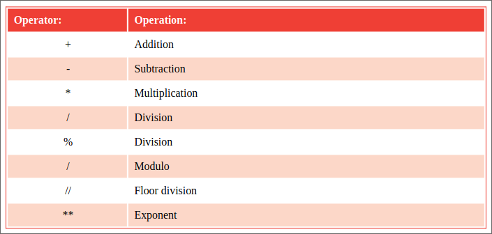

# Doing arithmetic

The arithmetical operators commonly used in Python programming are listed in
the table below, together with the operation they perform:
<p align="center">

</p>
The desired order in which the operations should be performed is unclear
but can be clarified by adding parentheses, like this:
```py
a = ( b * c ) - ( ( d % e ) / f )
```
The % modulo operator will divide the first given number by the second given
number and return the remainder of the operation. This is useful to determine
if a number has an odd or even value.

The // floor division operator performs just like the / division operator, but
truncates the result at the decimal point – removing any floating point value.

The ** exponent operator returns the result of the first operand raised to the
power of the second operand.

## Hot tip:
Values used with operators to form expressions are called "operands" – in the
expression 2 + 3 the numerical values 2 and 3 are the operands.

The '\t' escape sequence shown here adds an invisible tab 
character to format the output.

## Don't forget:
You can use the sep parameter to explicitly specify the separation
between output – here it specifies no spaces by assigning two 
unspaced single quote marks.


