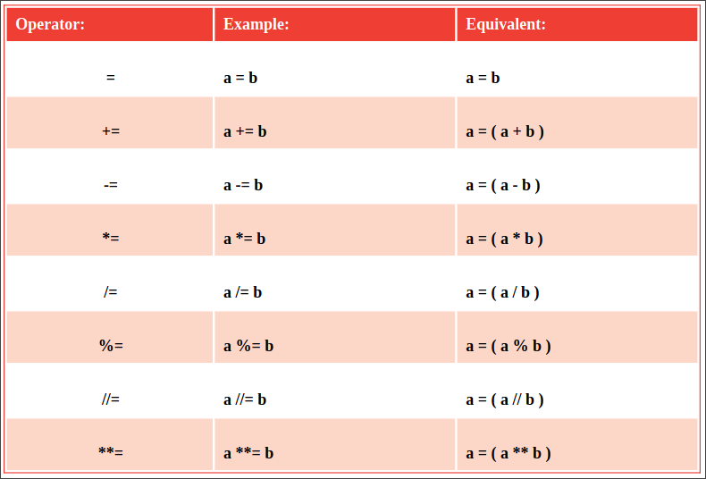

# Assigning values

The operators that are used in Python programming to assign values 
are listed in the table below. All except the simple = assignment operator
are a shorthand form of a longer expression, so each equivalent is given
for clarity:

## Don't forget
It is important to regard the = operator to mean "assign" rather than "equal"
to avoid confusion with the == equality operator.

## Beware
Unlike the = assign operator, the == equality operator compares operands 

