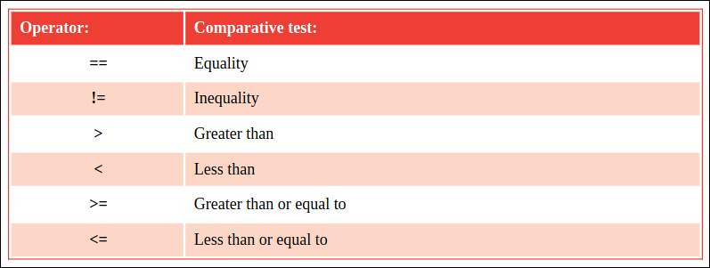

# Comparing values

The operators that are commonly used in Python programming to compare two
operand values are listed in the table below:

The == equality operator compares two operands and will return True if both 
are equal in value, otherwise it will return a False value. If both are the
same number they are equal, or if both are characters their ASCII code values
are compared numerically to achieve the comparison result.
Conversely, the != inequality operator returns True if two operands are not
equal, using the same rules as the == equality operator, otherwise it 
returns False.
Equality and inequality operators are useful in testing the state of two
variables to perform conditional branching in a program according to the
result.

The > "greater than" operator compares two operands and will return True if 
the first is greater in value than the second, or it will return False if it
is equal or less in value. The < "less than" operator makes the same 
comparison but returns True if the first operand is less in value than
the second, otherwise it returns False. A > "greater than" or < "less than"
operator is often used to test the value of an iteration counter in a loop.
Adding the = operator after a > "greater than" or < "less than" operator makes
it also return True if the two operands are exactly equal in value.

## Hot tip:
A-Z uppercase characters have ASCII code values 65-90 and a-z lowercase
characters have ASCII code values 97-122.

The \t escape sequence shown here adds an invisible tab character to format
the output.
The ASCII code value for uppercase “A” is 65, but for lowercase “a” it’s 97 –
so their comparison here returns False.
