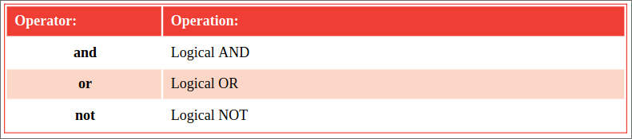

# Assessing logic

The logical operators most commonly used in Python programming are listed in
the table below:

The logical operators are used with operands that have Boolean values of True
or False, or are values that convert to True or False.
The (logical AND) and operator will evaluate two operands and return True only
if both operands themselves are True. Otherwise the and operator will 
return False.
This is used in conditional branching where the direction of a program is
determined by testing two conditions – if both conditions are satisfied, the
program will go in a certain direction, otherwise it will take a different
direction.
Unlike the and operator that needs both operands to be True, the (logical OR)
or operator will evaluate its two operands and return True if either one of the
operands itself returns True. If neither operand returns True, then the or
operator will return False. This is useful in Python programming to perform a 
certain action if either one of two test conditions has been met.
The (logical NOT) not operator is a unary operator that is used before a 
single operand. It returns the inverse value of the given operand, so if the 
variable a had a value of True then not a would have a value of False. 
The not operator is useful in Python programs to toggle the value of a variable
in successive loop iterations with a statement like a = not a. This ensures that
on each iteration of the loop, the Boolean value is reversed, like flicking a 
light switch on and off.

## Hot tip:
The term "Boolean" refers to a system of logical thought developed by the
English mathematician George.
Boole (1815-1864).

In Python programming, Boolean values can also be represented numerically
where True is 1 and False is 0 (zero).

## Don't forget:
Note that the expression False and False returns False, not True – perhaps
demonstrating the maxim "two wrongs don't make a right".
