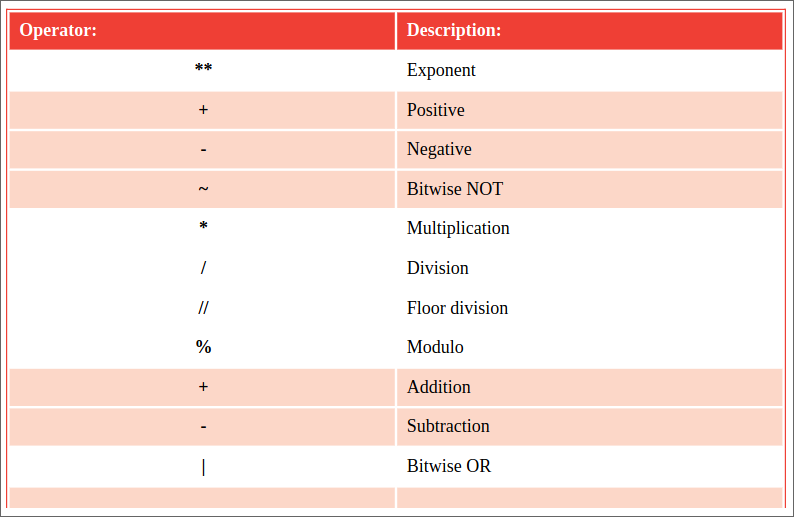
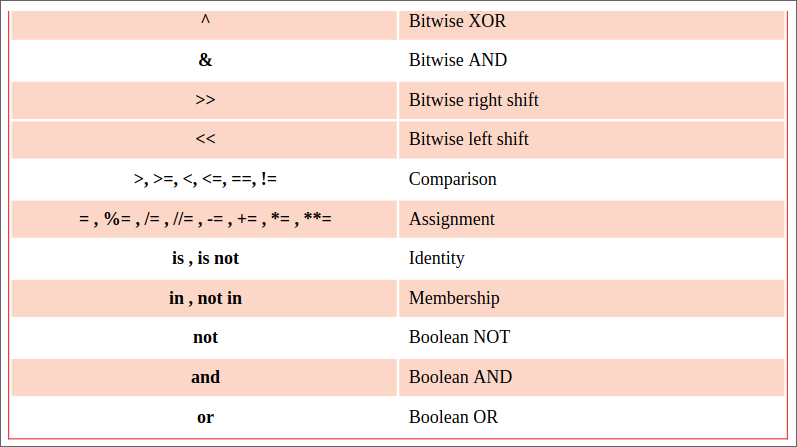

## Setting precedence

Operator precedence determines the order in which the Python interpreter
evaluates expressions. For example, in the expression 3 * 8 + 4 the default
order of precedence determines that multiplication is completed first, 
so the result is 28 (24 + 4).

The table below lists operator precedence in descending order – those on the
middle row have highest precedence, those on lower rows have successively
lower precedence. The precedence of operators on the same row is chained Left-
To-Right:

## Don't forget 
The `*` multiply operator is on a higher row than the `+` addition operator –
so in the expression 3 * 8 + 4 multiplication is completed first, 
before the addition.

The `//` floor division operator truncates floating point values at the 
decimal point – but the / division operator retains them.

## Beware
Do not rely upon default precedence – always use parentheses to clarify your
expressions.
