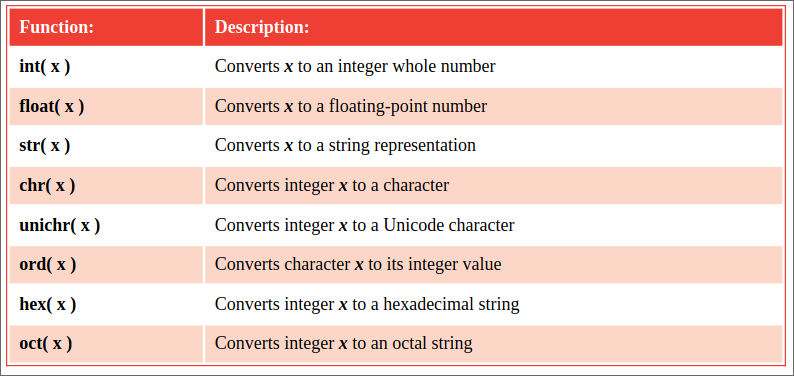

# Casting data types

Although Python variables can store data of any data type, it is important to
recognize the different types of data they contain to avoid errors when
manipulating that data in a program. There are several Python data types but
by far the most common ones are str (string), int (integer), and float
(floating-point).
Data type recognition is especially important when assigning numeric data to
variables from user input as it is stored by default as a str (string) 
data type. String values cannot be used for arithmetical expressions 
as attempting to add string values together simply concatenates (joins)
the values together rather than adding them numerically.
```py
For example '8' + '4' = '84'.
```
Fortunately, the data type of stored values can be easily converted (“cast”)
into a different data type using built-in Python functions. The value to be
converted is specified within the parentheses that follow the function name.
Casting str (string) values to become int (integer) values allows them to be
used for arithmetical expressions, for example, 8 + 4 = 12.
Python’s built-in data type conversion functions return a new object 
representing the converted value, and those conversion functions most
frequently used are listed in the table below:
<p align="center">

</p>

The Python built-in type() function can be used to determine to which data type
class the value contained in a variable belongs, simply by specifying that
variable’s name within its parentheses.

## Beware
Converting a float (floating-point) data type to an int (integer) data type
will truncate the number at the decimal point losing the fraction.
