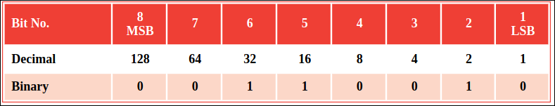
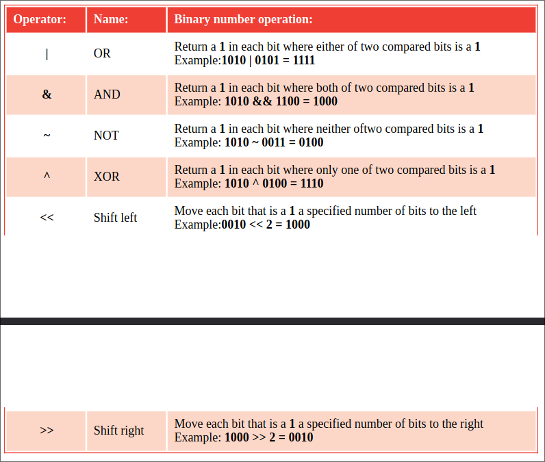

# Manipulating bits
In computer terms, each byte comprises eight bits that can each contain
a 1 or a 0 to store a binary number, representing decimal values 
from 0 to 255. Each bit contributes a decimal component only when that
bit contains a 1. Components are designated right-to-left from the
“Least Significant Bit” (LSB) to the “Most Significant Bit” (MSB).
The binary number in the bit pattern below is 00110010 and represents
the decimal number 50 (2+16+32):

It is possible to manipulate individual parts of a byte using the
Python “bitwise” operators listed and described below:

Unless programming for a device with limited resources there is seldom a need
to utilize bitwise operators, but they can be useful. For instance, the XOR
(eXclusive OR) operator lets you exchange values between two variables
without the need for a third variable.

## Don't forget
Many Python programmers never use bitwise operators but it is useful 
to understand what they are and how they may be used.

## Hot tip
Each half of a byte is known as a “nibble” (4 bits). The binary numbers in the
examples in the table describe values stored in a nibble.

## Beware
Do not confuse bitwise operators with logical operators. 
Bitwise operators compare binary numbers, whereas logical operators evaluate
Boolean values.
