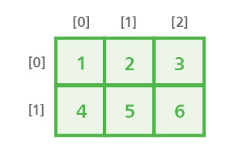

# Writing lists

In Python programming, a variable must be assigned an initial value 
(initialized) in the statement that declares it in a program, otherwise the 
interpreter will report a "not defined" error.

<p class="center">


</p>

Multiple variables can be initialized with a common value in a single 
statement using a sequence of = assignments. For example, to simultaneously
assign a common value to three variables:

```py
a = b = c = 10
```

Alternatively, multiple variables can be initialized with differing values in
a single statement using comma separators. For example, to simultaneously 
assign different values to three variables:

```py
a,b,c=1,2,3
```

Unlike regular variables, which can only store a single item of data, a Python
“list” is a variable that can store multiple items of data. The data is stored
sequentially in list “elements” that are index numbered starting at zero. So the
first value is stored in element zero, the second value is stored in element one,
and so on.
A list is created much like any other variable, but is initialized by assigning
values as a comma-separated list between square brackets. For example, creating
a list named “nums”, like this:

```py
nums = [ 0 , 1 , 2 , 3 , 4 , 5 ]
```

An individual list element can be referenced using the list name followed by
square brackets containing that element’s index number. This means that 
nums[1]references the second element in the example above – not the first
element, as element numbering starts at zero.

<p class="center">



</p>

Lists can have more than one index – to represent multiple dimensions, rather
than the single dimension of a regular list. Multi-dimensional lists of three
indices and more are uncommon, but two-dimensional lists are useful to store
grid-based information such as X,Y coordinates.
A list of string values can even be considered to be a multi-dimensional list,
as each string is itself a list of characters. So each character can be 
referenced by its index number within its particular string.

