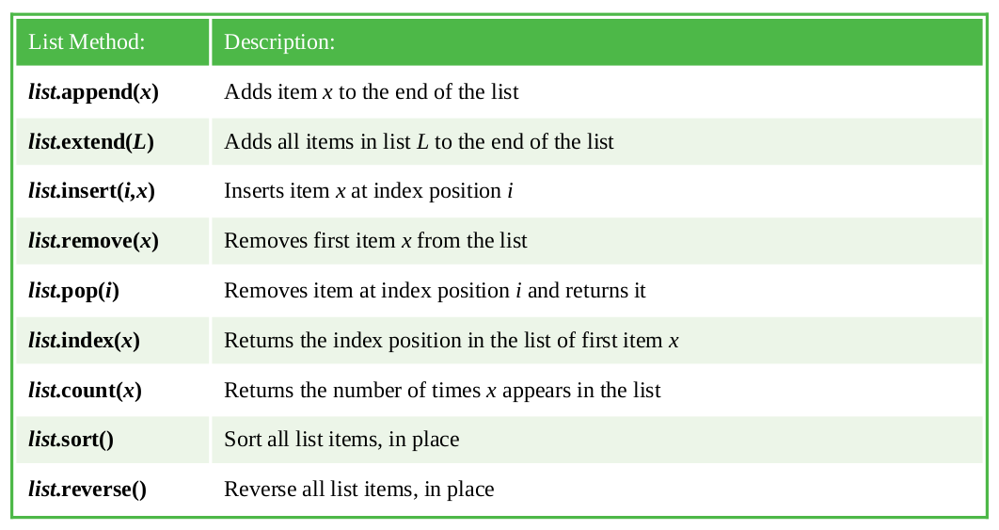

# Manipulating lists

List variables, which can contain multiple items of data, are widely used in
Python programming and have a number of “methods” that can be “dot-
suffixed” to the list name for manipulation:

Python also has a useful `len(L)` function that returns the length of the
list `L` as the total number of elements it contains. Like the `index()` and
`count()` methods, the returned value is numeric so cannot be directly
concatenated to a text string for output.
String representation of numeric values can, however, be produced by Python’s
`str(n)` function for concatenation to other strings, which returns a string
version of the numeric n value. Similarly, a string representation of an
entire list can be returned by the `str(L)` function for concatenation to
other strings.
In both cases, remember that the original version remains unchanged as the
returned versions are merely copies of the original version.
Individual list elements can be deleted by specifying their index number to
the Python `del(i)` function. This can remove a single element at a
specified `i` index position, or a “slice” of elements can be removed using
slice notation `i1:i2` to specify the index number of the first and last
element. In this case, `i1` is the index number of the first element to be
removed and all elements up to, but not including, the element at the `i2`
index number will be removed.

## Hot tip

For lists that contain both numerical and string values, the sort() method
returns the list elements sorted first numerically then alphabetically –
for example as `1,2,3,A,B,C`.

Python also has an int(s) function that returns a numeric version of the
string `s` value.
