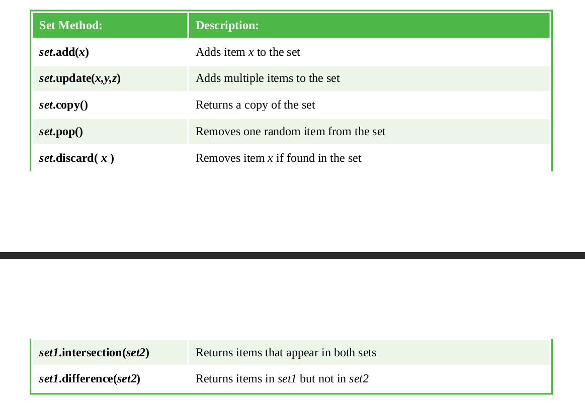

# Restricting lists

## Tuple
The values in a regular list can be changed as the program proceeds (they are
"mutable"), but a list can be created with fixed "immutable" values that cannot
be changed by the program.
A restrictive immutable Python list is known as a "tuple" and is created by
assigning values as a comma-separated list between parentheses in a process
known as "tuple packing":

```py
colors-tuple = ( 'Red' , 'Green' , 'Red' , 'Blue', 'Red' )
```

An individual tuple element can be referenced using the tuple name followed by
square brackets containing that element's index number. Usefully, all values
stored inside a tuple can be assigned to individual variables in a process known
as "sequence unpacking":

```py
a , b , c , d , e = colors-tuple
```
## Set
The values in a regular list can be repeated in its elements, as in the tuple above,
but a list of unique values can be created where duplication is not allowed. A
restrictive Python list of unique values is known as a "set" and is created by
assigning values as a comma-separated list between curly brackets (braces):

```py
phonetic-set = { 'Alpha' , 'Bravo' , 'Charlie' }
```

Individual set elements cannot be referenced using the set name followed by
square brackets containing an index number, but instead sets have methods that
can be dot-suffixed to the set name for manipulation and comparison:

<p class="center">



</p>

## Don't forget
Like index numbering with lists, the items in a tuple sequence are numbered
from zero.

## Beware
There must be the same number of variables as items to unpack a tuple.

## Hot tip
More set methods can be found in the Python documentation.