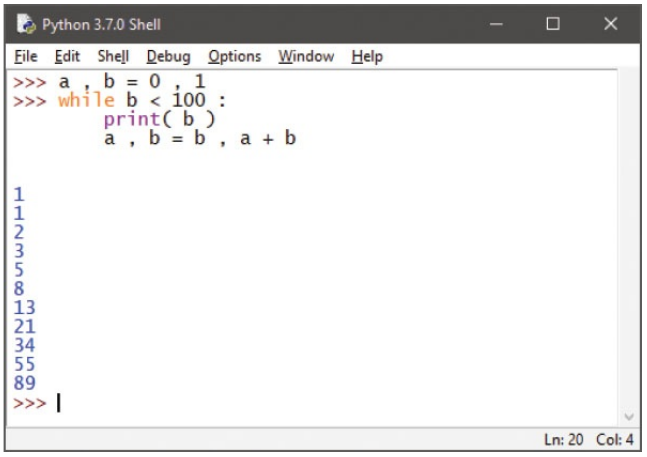

# Looping while true

A loop is a piece of code in a program that automatically repeats. One complete
execution of all statements within a loop is called an "iteration" or a "pass". The
length of the loop is controlled by a conditional test made within the loop. While
the tested expression is found to be True, the loop will continue – until the tested
expression is found to be False, at which point the loop ends.

In Python programming, the while keyword creates a loop. It is followed by the
test expression then a `:` colon character. Statements to be executed when the test
succeeds should follow below on separate lines, and each line must be indented
the same space from the while test line. This statement block must include a
statement that will at some point change the result of the test expression
evaluation – otherwise an infinite loop is created.

Indentation of code blocks must also be observed in Python's interactive mode –
like this example that produces a Fibonacci sequence of numbers from a while
loop:

Loops can be nested, one within another, to allow complete execution of all
iterations of an inner nested loop on each iteration of the outer loop. A "counter"
variable can be initialized with a starting value immediately before each loop
definition, included in the test expression, and incremented on each iteration
until the test fails – at which point the loop ends.

## Don't forget
Unlike other Python keywords, the keywords True and False begin with
uppercase letters.

## Hot tip
Hit Return to move to the next line and see the interpreter automatically indent
the new line as it expects further statements. Hit Return again to execute the
entered code.

The output printed from the inner loop is indented from that of the outer loop by
the `\t` tab character.

The `+=` assignment statement `i += 1` is simply a shorthand way to say `i = i+1` –
you can also use `*= /= -=` shorthand to assign values to variables.